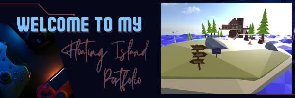
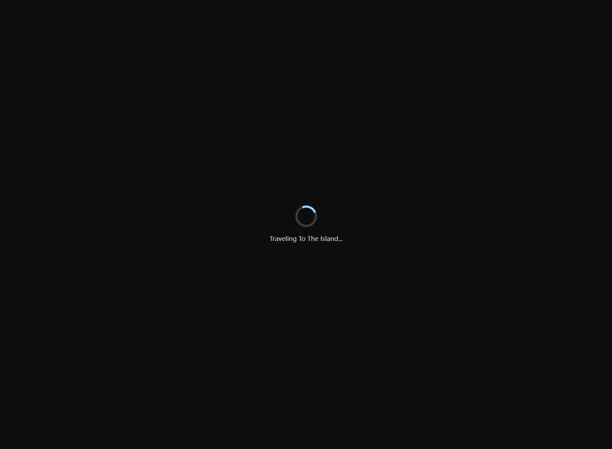
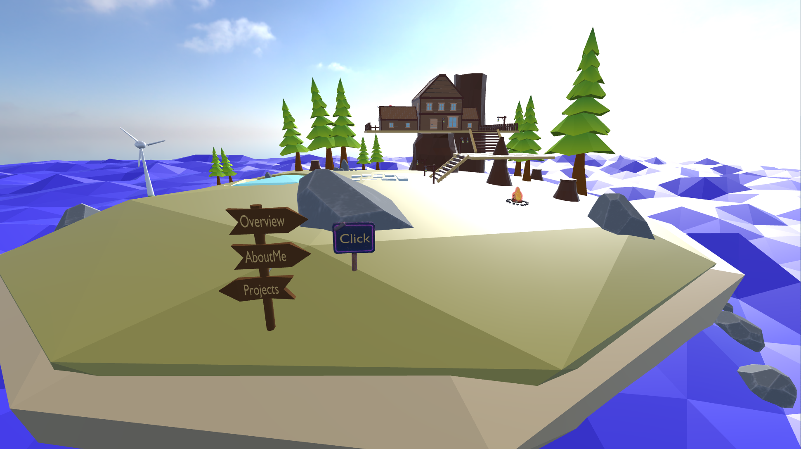
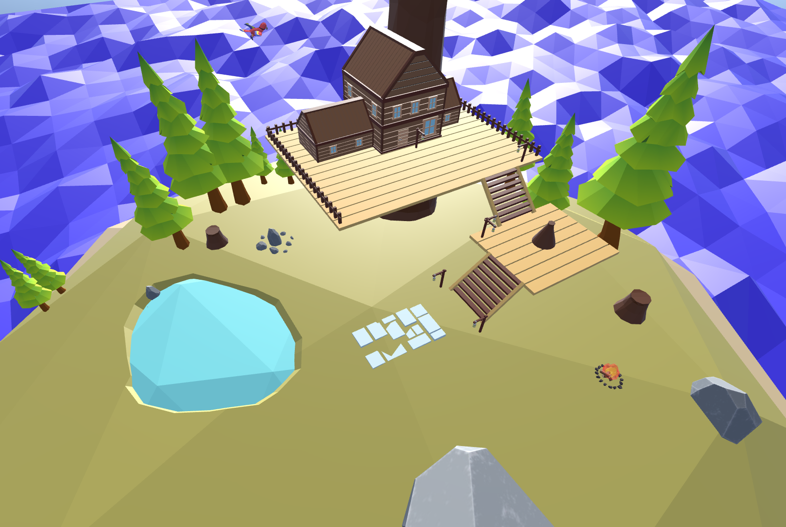
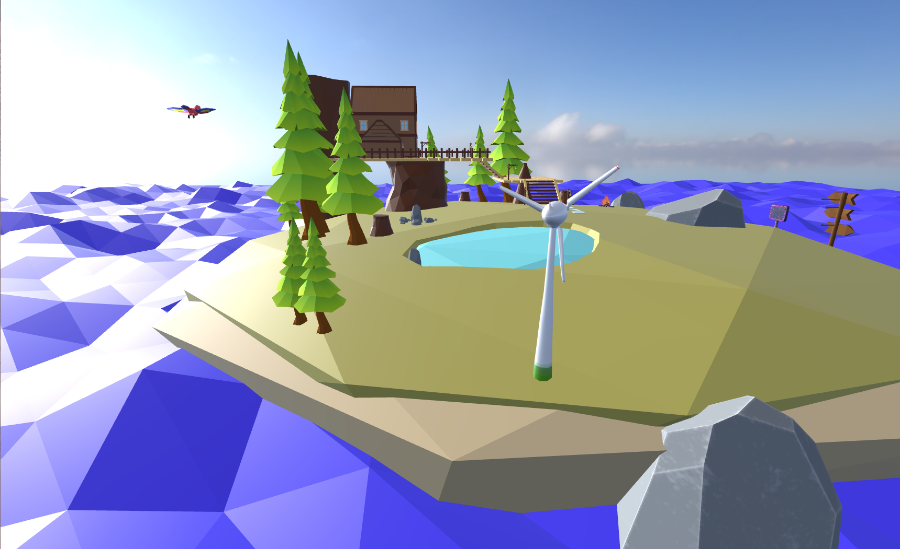
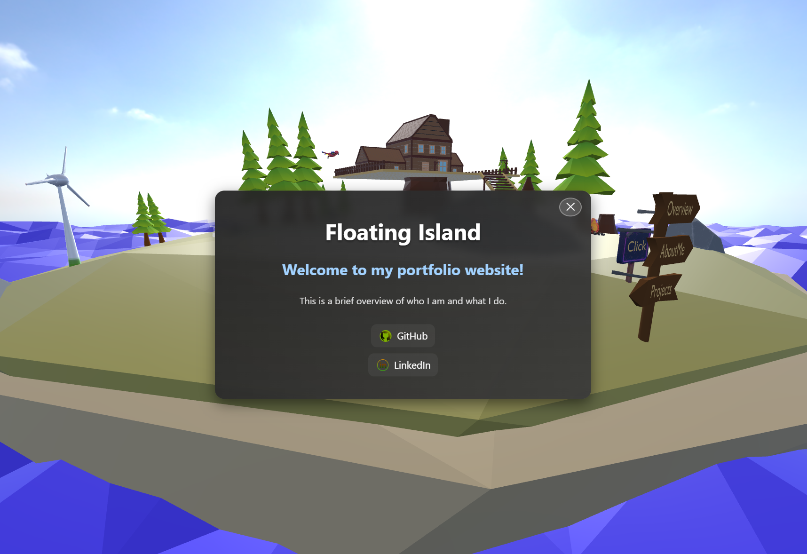
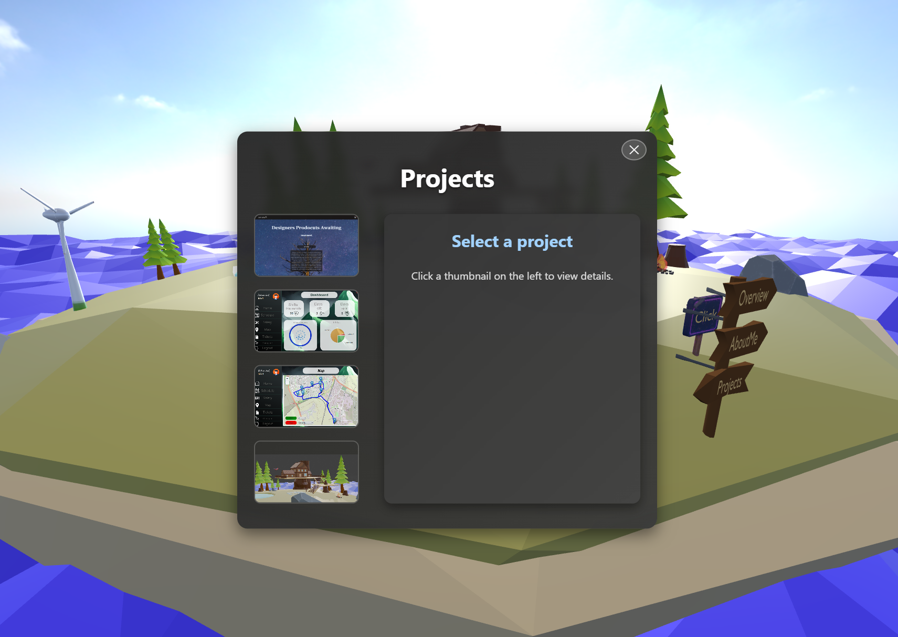

<p align="center">
  
</p>

## 


<p align="center">
  <!-- Core project info -->
  
  
  
  
  
  
  <br/>

  <!-- Tech stack -->
  
  
  
  
  
  
  

</p>

## 📋 Overview
**Floating Island** is a web-based 3D scene built with Three.js, GSAP, and Vite.
 Users can explore it in the browser, interact with elements.

This project showcases immersive 3D web design, object interactions, and animation control in a modern browser environment.

---

## 🚀 Motivation for Development

Create a visually stunning 3D experience that can run in modern browsers

Demonstrate mastery of Three.js, loading models, textures, lighting, and animations

Use GSAP animations to make scene transitions smooth and dynamic

Build a portfolio piece that stands out and can be deployed as a web experience

---
## ✨ Features
- Orbit-style camera control with smooth movement

- Dynamic lighting (ambient, point lights)

- Model + texture loading 

- Interactive elements / raycasting 

- GSAP-controlled camera & scene animations

- Responsive design 


---

## ⚙️ Technology Stack
- **JavaScript** 

- **Three.js** — 3D rendering and scene graph

- **GSAP** — Timing, tweening, animations

- **Vite** — Dev server + bundler

- **GLTFLoader / DRACOLoader** — model loaders

- **HTML & CSS** — structure and styling

---

## Screenshots

<div style="display: flex; gap: 10px;">
  
</div>
<div style="display: flex; gap: 10px;">
  
</div>
<div style="display: flex; gap: 10px;">
  
</div>
<div style="display: flex; gap: 10px;">
  
</div>
<div style="display: flex; gap: 10px;">
  
</div>
<div style="display: flex; gap: 10px;">
  
</div>

---

## 💡 Getting Started

#### Prerequisites

Node.js v16+ (or your target version)

three.js


### Installation

#### 1. Clone the Repository
```bash
git clone https://github.com/Kfir989/Floating-Island.git
cd Floating-Island
npm install
````

#### 2. Run development server
````
npm run dev

````

---
